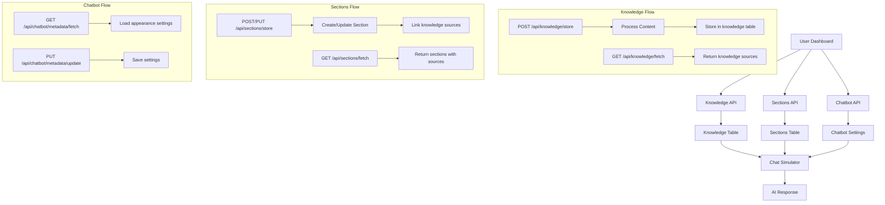
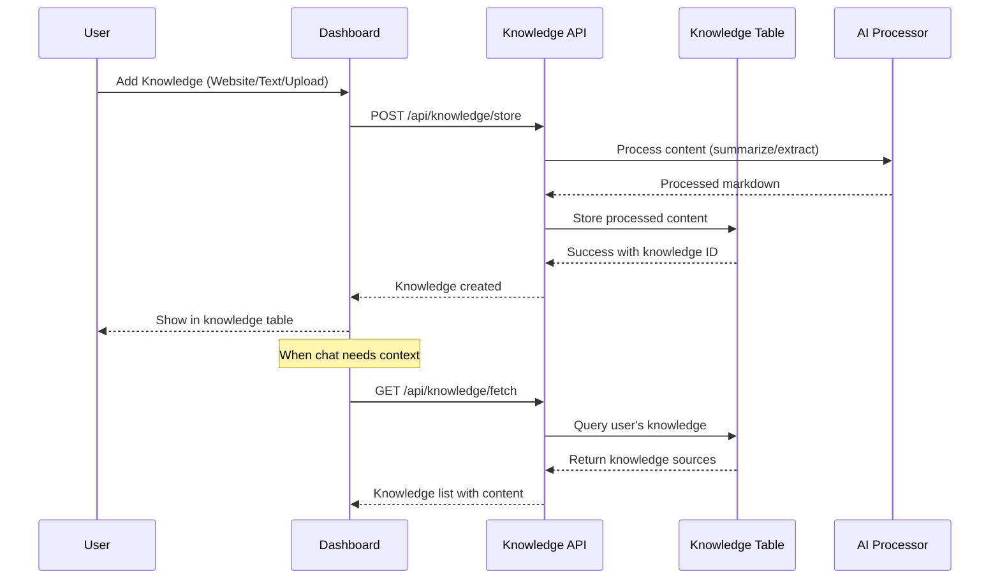
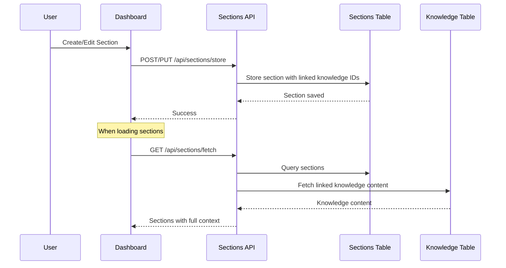
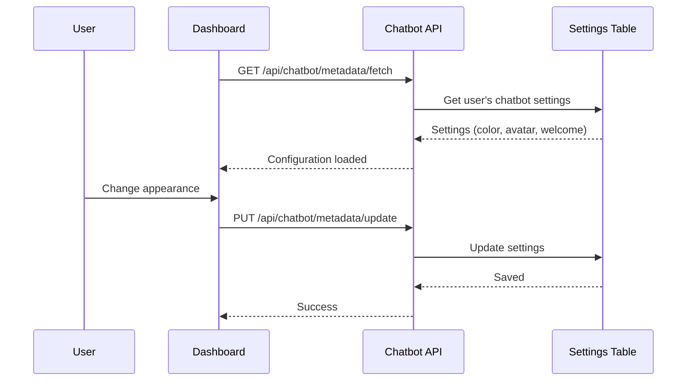
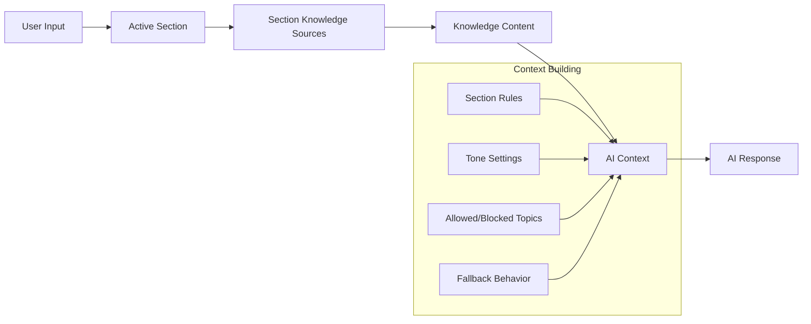

# System Architecture Flow: Sections, Chatbot & Knowledge

## 📋 Overview
This document explains how the three main components (Sections, Chatbot, Knowledge) work together, their APIs, data flow, and context passing in the chat simulator.

---

## 🗄️ Database Schema

### Knowledge Table
```sql
knowledge {
  id: text (primary key)
  user_email: text (not null)
  workspace_id: text (not null)
  title: text (not null)           // Display name
  content: text (not null)         // Processed markdown content
  type: text (not null)            // 'website' | 'text' | 'upload'
  status: text (not null)          // 'active' | 'training' | 'error' | 'excluded'
  source_url: text                 // Original URL (for website type)
  meta_data: text                  // Additional metadata JSON
  created_at: text (default now())
}
```

### Sections Table
```sql
sections {
  id: text (primary key)
  user_email: text (not null)
  workspace_id: text (not null)
  name: text (not null)            // Section name
  description: text (not null)     // When to use this section
  tone: text (not null)            // 'neutral' | 'friendly' | 'professional' | 'strict'
  scope_label: text (not null)     // 'general' | custom labels
  allowed_topics: text             // JSON array of allowed topics
  blocked_topics: text             // JSON array of blocked topics
  fallback_behavior: text (not null) // 'escalate' | 'refuse' | 'general_answer'
  source_ids: text                 // JSON array of knowledge IDs
  status: text (not null)          // 'active' | 'inactive'
  created_at: text (default now())
}
```

### Chatbot Metadata
```sql
// Stored in separate metadata table or chatbot_settings
{
  primaryColor: text
  welcomeMessage: text
  avatarSrc: text
  widgetId: text
  user_email: text
  workspace_id: text
}
```

---

## 🔄 API Flow Diagram



---

## 📊 Detailed Data Flow

### 1. Knowledge Management Flow



### 2. Sections Management Flow



### 3. Chatbot Configuration Flow



---

## 🤖 Chat Simulator Context Flow

### How Context Gets Passed to Chat



### Chat Context Processing

```typescript
// Chat Simulator Context Structure
interface ChatContext {
  // Active section context
  activeSection: {
    id: string
    name: string
    tone: 'neutral' | 'friendly' | 'professional' | 'strict'
    allowedTopics: string[]
    blockedTopics: string[]
    fallbackBehavior: 'escalate' | 'refuse' | 'general_answer'
  }
  
  // Knowledge sources for this section
  knowledgeSources: Array<{
    id: string
    title: string
    content: string      // Processed markdown
    type: string        // 'website' | 'text' | 'upload'
    source_url?: string
  }>
  
  // Chatbot appearance
  appearance: {
    primaryColor: string
    avatarSrc: string
    welcomeMessage: string
  }
  
  // Conversation history
  messages: Array<{
    role: 'user' | 'assistant'
    content: string
    timestamp: string
  }>
}
```

---

## 🔗 API Endpoints Summary

### Knowledge APIs
- **POST** `/api/knowledge/store` - Add/update knowledge source
- **GET** `/api/knowledge/fetch` - Get all user's knowledge sources
- **DELETE** `/api/knowledge/delete` - Delete knowledge source

### Sections APIs
- **POST** `/api/sections/store` - Create new section
- **PUT** `/api/sections/store` - Update existing section
- **GET** `/api/sections/fetch` - Get all user's sections
- **DELETE** `/api/sections/delete` - Delete section

### Chatbot APIs
- **GET** `/api/chatbot/metadata/fetch` - Get chatbot settings
- **PUT** `/api/chatbot/metadata/update` - Update chatbot settings

---

## 🎯 Key Integration Points

### 1. Knowledge → Sections
- Sections link to multiple knowledge sources via `source_ids` JSON array
- When a section is loaded, it fetches full content from linked knowledge
- Knowledge content provides the "brain" for section responses

### 2. Sections → Chat Simulator
- Active section determines conversation context
- Section tone affects response style
- Allowed/blocked topics filter responses
- Fallback behavior handles out-of-scope questions

### 3. Chatbot Settings → UI
- Primary color sets chat theme
- Avatar image shows in chat
- Welcome message starts conversations
- Widget ID enables embed functionality

---

## 🔄 Complete User Journey

```mermaid
journey
    title User Journey: Knowledge to Chat
    section Setup Phase
      Add Knowledge: 5: User
        User adds website/text/upload
        System processes and stores content
      Create Sections: 4: User
        User creates sections with rules
        User links knowledge to sections
      Configure Chatbot: 3: User
        User sets appearance
        System saves preferences
    
    section Chat Phase
      Start Chat: 5: User
        Chat loads with welcome message
        System shows active sections
      Send Message: 5: User
        User types message
        System applies section context
      Get Response: 4: System
        AI uses linked knowledge
        System follows section rules
        Response matches tone setting
```

---

## 🚀 Performance Optimizations

### 1. Knowledge Processing
- Content is processed once during upload
- Stored as optimized markdown for fast retrieval
- Indexed by workspace for quick queries

### 2. Context Loading
- Sections cache linked knowledge content
- Chat simulator loads context once per session
- Incremental updates when sections change

### 3. Response Generation
- Knowledge context filtered by section rules
- Tone applied during response generation
- Fallback behavior prevents hallucinations

---

## 🛡️ Security & Multi-tenancy

### Workspace Isolation
- All queries filtered by `workspace_id`
- Users can only access their own data
- Section-knowledge links respect workspace boundaries

### Data Flow Security
- API calls validate user session
- Workspace context enforced in all queries
- Cross-tenant data leakage prevented

---

## 📝 Summary

1. **Knowledge** provides the raw content (processed documents, websites, text)
2. **Sections** organize knowledge with rules and context (when to use, how to respond)
3. **Chatbot** configures the appearance and behavior (colors, avatar, welcome message)
4. **Chat Simulator** combines all three to generate contextual responses

The system ensures that:
- Knowledge is processed once and reused
- Sections provide intelligent context filtering
- Chat responses are relevant and properly styled
- User data remains secure and isolated
